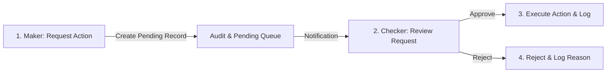

# 💳 Web Merchant Integration System 2.0

## 🔒 Source Code Availability
> [!IMPORTANT]
> **Proprietary Software Notice**  
> This project is a proprietary enterprise application developed for a financial organization. Due to strict confidentiality and intellectual property restrictions, the source code cannot be made public. This repository serves as a portfolio showcase outlining the system design, migration architecture, features, and business impact.

---

## 📋 Project Overview

This project represents the complete migration and redesign of a legacy fintech merchant processing system. The original system (built on .NET 4.6) was unstable, difficult to maintain, and lacked the flexible configurations required for banking operations. 

I redesigned and rebuilt the platform from scratch using **.NET 8** and **Clean Architecture** principles. The system is deployed in production and manages daily operational settlement workflows for multiple banking partners.

---

## 🔒 Maker-Checker (Four-Eyes Principle) Flow

All critical actions (like managing batch services or modifying merchant accounts) must go through a secure multi-level approval workflow:

---

## 🚀 Key Business Impact

- **Architecture Migration**: Transitioned from a legacy monolithic structure to a highly modular .NET 8 codebase.
- **Improved Reliability**: Eliminated recurring production freezes during auto batch executions.
- **Operational Safety**: Implemented the maker-checker mechanism, reducing operator errors.
- **Enhanced Configuration**: Enabled support for merchant-specific settlement schedules and transaction validations without requiring code changes.
- **Compliance Alignment**: Integrated comprehensive system audits to meet strict banking audit requirements.

---

## ⚙️ Core Features & System Architecture

### 1. Multi-Level Maker-Checker Workflow
- Any configuration change or batch trigger initiated by a "Maker" must be approved by a "Checker" before execution.
- Prevents unauthorized edits and logs both parties for compliance tracking.

### 2. Auto Batch Services Management
- Admin panels to control, schedule, and trigger auto batch services that interface with clearing house servers.
- Dynamic starting, stopping, and parameter tuning for background batch processes.

### 3. Real-Time AS400 DB2 Integration
- Transactions and merchant configurations are validated in real time against legacy IBM DB2 database hosts.
- Employs fail-safe fallback methods to handle connectivity drops gracefully.

### 4. Granular Role-Based Access Control (RBAC)
- Hierarchical permission trees allowing operators access only to their specific business domains.

### 5. Detailed Compliance Logging & Exporting
- Records every action, payload change, timestamp, and operator IP.
- Features formatted report export (CSV/TXT) for easy compliance auditing.

---

## 🛠️ System Architecture Stack

| Layer | Technologies Used | Design Pattern / Focus |
| :--- | :--- | :--- |
| **Presentation (Web)** | ASP.NET Core MVC, Razor Pages, Bootstrap | Clean dashboard UI, state-driven widgets |
| **Core (Domain)** | C# (.NET 8), Entity Models | Business validation, Interface definitions |
| **Infrastructure** | Entity Framework Core, ADO.NET | Repository Pattern, legacy DB2 connectors |
| **Databases** | MS SQL Server, IBM DB2 (AS400) | Stored procedures, high-throughput indexes |

---

## 📄 License

This documentation and portfolio showcase outline are licensed under the MIT License - see the [LICENSE](file:///c:/Users/Sarim/Desktop/Project%20Development/Web-Merchant-Integration-System-2.0/LICENSE) file for details.
